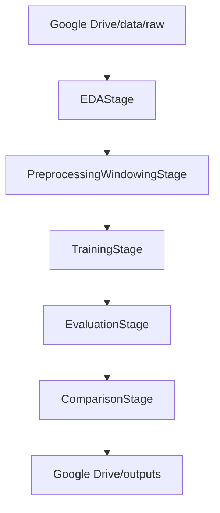

# Arquitectura del proyecto

El proyecto se ejecuta principalmente en Google Colab conectado a Google Drive. La ejecución pesada de entrenamiento se realiza en Colab para aprovechar GPU, mientras que Google Drive se utiliza como almacenamiento persistente de datos, modelos, métricas, predicciones y reportes.

## Componentes

- `main.py`: punto único de entrada del pipeline.
- `config/config.colab.yaml`: configuración principal de rutas, modelos y parámetros.
- `src/scania_outliers`: paquete Python con clases y funciones reutilizables.
- `notebooks`: material de apoyo para visualización, interpretación y defensa.
- `Google Drive/TFM_SCANIA`: almacenamiento de datos y artefactos pesados.

## Flujo

El dataset no se vuelve a dividir. Se respetan las particiones oficiales `train`, `validation` y `test`.
