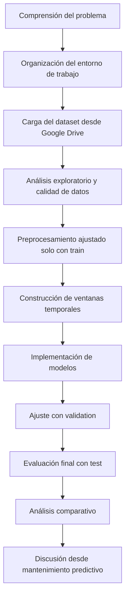

# Metodología final del TFM

## 6.1. Enfoque metodológico de la investigación

La presente investigación se desarrolla bajo un enfoque aplicado, cuantitativo y experimental. Su finalidad es implementar y comparar modelos de aprendizaje profundo para la detección de outliers temporales multivariados en lecturas operacionales de componentes de motores de vehículos pesados. La metodología se organiza de forma secuencial para garantizar que la caracterización del dataset, el preprocesamiento, la construcción de ventanas temporales, el entrenamiento de modelos y la evaluación final respondan de manera coherente a los objetivos e hipótesis planteados.

El estudio utiliza el dataset SCANIA Component X como base empírica. Este conjunto de datos contiene lecturas operacionales, especificaciones y registros asociados a eventos de reparación, por lo que permite abordar un problema aplicado de mantenimiento predictivo sobre datos industriales reales. El trabajo no pretende realizar un diagnóstico causal completo ni un pronóstico formal de vida útil remanente, sino identificar trayectorias operacionales atípicas que puedan analizarse como outliers temporales multivariados dentro de un contexto de mantenimiento predictivo.

## 6.2. Pipeline metodológico general

El proceso metodológico comprende: comprensión del problema, organización del entorno de trabajo, carga del dataset desde Google Drive, análisis exploratorio, evaluación de calidad de datos, preprocesamiento, construcción de secuencias temporales, implementación de modelos, ajuste con el conjunto de validación, evaluación final con test y análisis comparativo de resultados.

## 6.3. Entorno de desarrollo y arquitectura de trabajo

El entorno de desarrollo se organiza alrededor de Google Colab, Google Drive y GitHub. Google Colab se utiliza como entorno de ejecución para el procesamiento y entrenamiento de modelos. Google Drive almacena los datos originales, datos procesados, modelos entrenados y resultados generados. GitHub se emplea para versionar código, notebooks, documentación, configuración y scripts auxiliares.

Esta separación responde a buenas prácticas de proyectos de Big Data y machine learning: los datos pesados no se versionan en Git, mientras que el código y la documentación se mantienen trazables.

## 6.4. Ingesta y control inicial de datos

La ingesta de datos se realizará desde Google Drive, montado en Google Colab. Los archivos originales se conservarán sin modificaciones dentro de la carpeta `raw`, mientras que las versiones limpias, agregadas o transformadas se almacenarán en `processed`. Debido al tamaño de los archivos de lecturas operacionales, la carga inicial se realizará con PySpark. Pandas se reservará para muestras, resultados agregados o tablas finales de tamaño manejable.

## 6.5. Análisis exploratorio y calidad de datos

El análisis exploratorio permitirá revisar particiones, número de vehículos, cantidad de registros, distribución de lecturas por vehículo, tipos de variables, valores faltantes, duplicados, variables constantes o de baja variabilidad, rango temporal de las trayectorias y balance de etiquetas disponibles. Además, se analizará la distribución de diferencias entre valores consecutivos de `time_step` para documentar si las ventanas representan segmentos secuenciales de operación o intervalos temporales equivalentes.

## 6.6. Preprocesamiento de datos

El preprocesamiento se ejecutará respetando la separación entre train, validation y test. Las decisiones de selección de variables, imputación y escalado se ajustarán únicamente con datos de entrenamiento, y los parámetros resultantes se aplicarán posteriormente a validation y test. Esta práctica reduce el riesgo de fuga de información y facilita la reproducibilidad.

## 6.7. Construcción de secuencias temporales multivariadas

Las lecturas operacionales se transformarán en secuencias temporales multivariadas mediante ventanas deslizantes. Cada ventana se construirá a partir de observaciones ordenadas temporalmente por vehículo. El tamaño de ventana determinará el número de pasos temporales incluidos en cada muestra, mientras que el stride definirá el desplazamiento entre ventanas consecutivas.

## 6.8. Estrategia normal/atípica y puntuación de atipicidad

Los modelos generarán puntuaciones de atipicidad por ventana temporal. En modelos basados en reconstrucción, esta puntuación se calculará a partir del error de reconstrucción. Posteriormente, las puntuaciones se transformarán en una decisión normal/atípica mediante un umbral ajustado sobre validation.

## 6.9. Evaluación a nivel ventana y vehículo

Dado que las etiquetas disponibles no necesariamente describen cada observación temporal individual, sino que pueden estar asociadas al vehículo, trayectoria o evento de reparación, la evaluación se organizará en dos niveles. En primer lugar, los modelos generarán puntuaciones de atipicidad por ventana temporal multivariada. En segundo lugar, dichas puntuaciones se agregarán a nivel de vehículo o trayectoria mediante medidas como el máximo, la media, el percentil 95 y la proporción de ventanas clasificadas como atípicas. La evaluación principal se realizará sobre esta representación agregada cuando las etiquetas disponibles correspondan al nivel de vehículo, mientras que el análisis por ventana se utilizará como apoyo exploratorio.

## 6.10. Modelos propuestos

Se implementarán tres modelos principales: LSTM Autoencoder, CNN-LSTM Autoencoder y Transformer Encoder simplificado. El LSTM Autoencoder se plantea como modelo base para representar la dinámica temporal de las trayectorias. El CNN-LSTM Autoencoder incorpora una etapa convolucional para capturar patrones locales antes del modelado temporal recurrente. El Transformer Encoder simplificado se considera una alternativa basada en atención para representar dependencias de mayor alcance.

## 6.11. Entrenamiento, validación y umbrales

El conjunto train se utilizará para ajustar los modelos. Para early stopping se empleará un subconjunto interno de train, evitando utilizar validation como validación de pérdida cuando contenga trayectorias potencialmente atípicas. El conjunto validation se reservará para ajustar umbrales, seleccionar hiperparámetros y elegir la configuración final. El conjunto test se mantendrá como evaluación final sobre datos no vistos.

## 6.12. Métricas y criterios de evaluación

Cuando se disponga de etiquetas o referencias de evaluación, se calcularán Precision, Recall, F1-score, ROC-AUC y PR-AUC. En escenarios con fuerte desbalance, PR-AUC y F1-score tendrán especial relevancia porque se centran en la clase atípica. También se reportarán métricas operativas como tiempo de entrenamiento, tiempo de inferencia y estabilidad del entrenamiento.

## 6.13. Reproducibilidad y MLOps

El proyecto mantendrá separación entre código, datos, modelos y salidas; configuración centralizada; registro de parámetros, métricas, artefactos y predicciones; notebooks numerados; y pruebas mínimas de componentes críticos. Aunque el TFM no contempla un despliegue productivo, estas prácticas fortalecen la trazabilidad del flujo experimental y reducen errores metodológicos.

## 6.14. Gestión de riesgos

Durante el desarrollo se utilizarán subconjuntos acotados de vehículos para validar el pipeline y controlar el consumo de memoria en Google Colab. Los resultados finales se obtendrán sobre el conjunto completo disponible. En caso de que las restricciones computacionales obliguen a trabajar con una muestra, esta decisión será documentada explícitamente, indicando el criterio de selección, el número de vehículos utilizados y las limitaciones que introduce.
