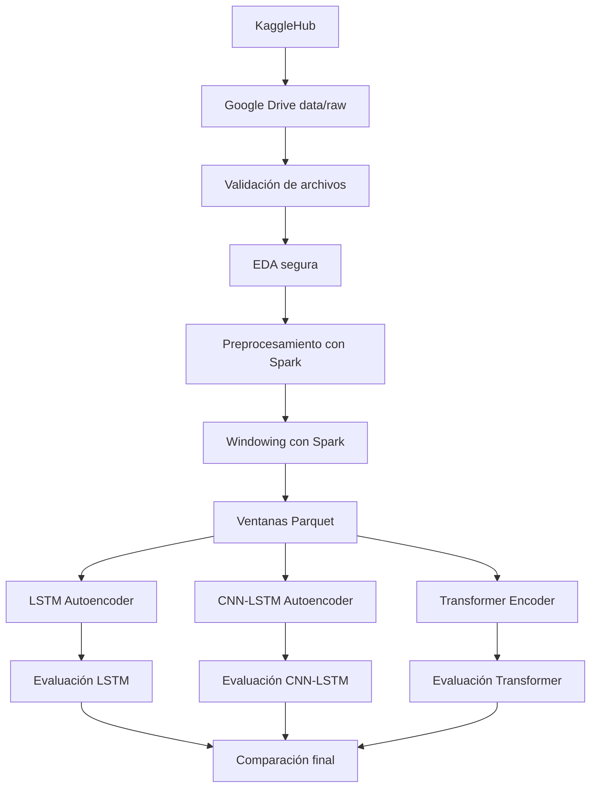

# Arquitectura del proyecto

## Arquitectura general

## Separación de responsabilidades

| Componente | Responsabilidad |
|---|---|
| `scripts/run_colab_safe.py` | Ejecuta el flujo seguro por etapas en Colab |
| `main.py` | Punto de entrada general del pipeline |
| `config/*.yaml` | Parámetros de ejecución, rutas, modelos y evaluación |
| `spark_session.py` | Configuración Spark sin Arrow para Colab |
| `preprocessing.py` | Imputación y escalado ajustados solo con train |
| `spark_windowing.py` | Construcción Spark-native de ventanas temporales |
| `datasets.py` | Lectura de ventanas Parquet hacia PyTorch |
| `model_factory.py` | Creación de los tres modelos |
| `training/trainer.py` | Entrenamiento de autoencoders |
| `evaluation` / `model_evaluation.py` | Métricas y comparación |

## Decisiones de estabilidad

- Código ejecutado desde `/content`.
- Datos persistidos en Drive.
- Ventanas en Parquet particionado.
- Sin `toPandas()` en el pipeline principal.
- Un modelo por corrida.
- Comparación final al terminar los tres modelos.
